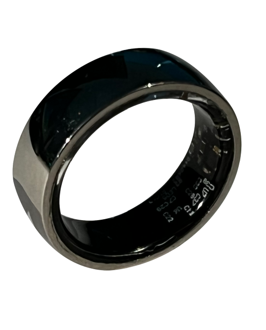
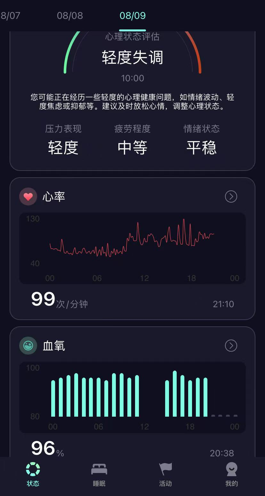
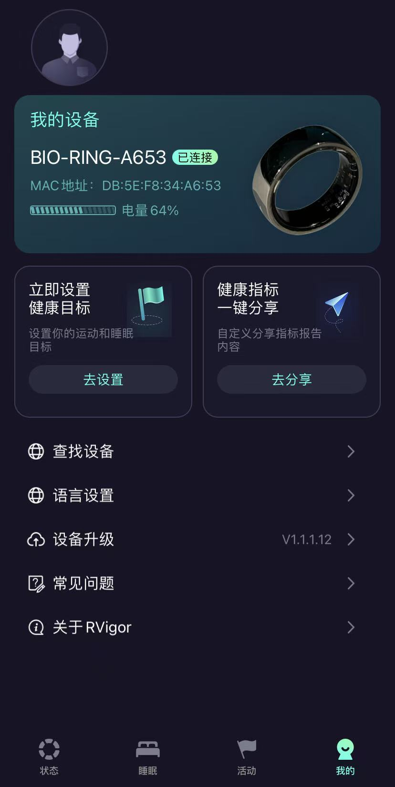
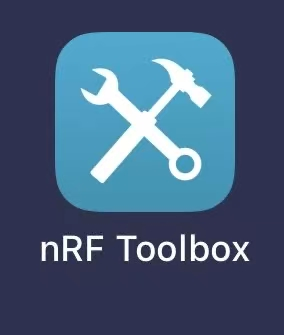
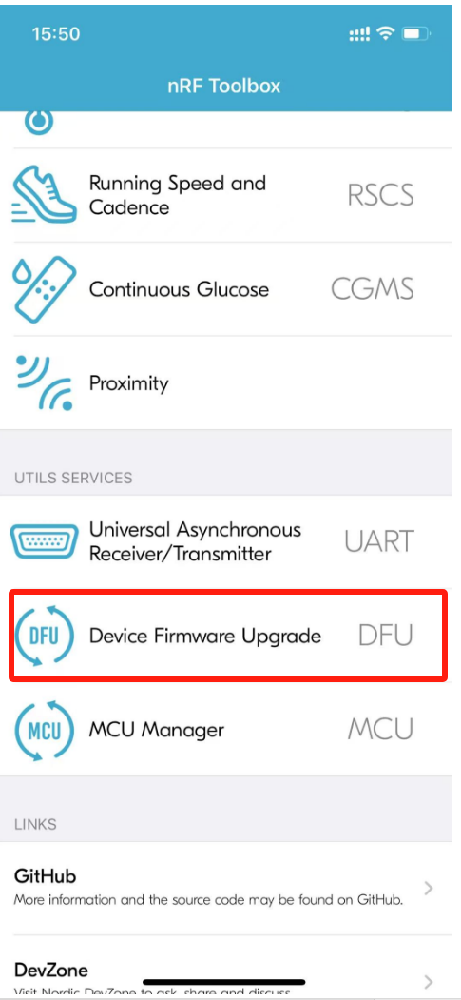
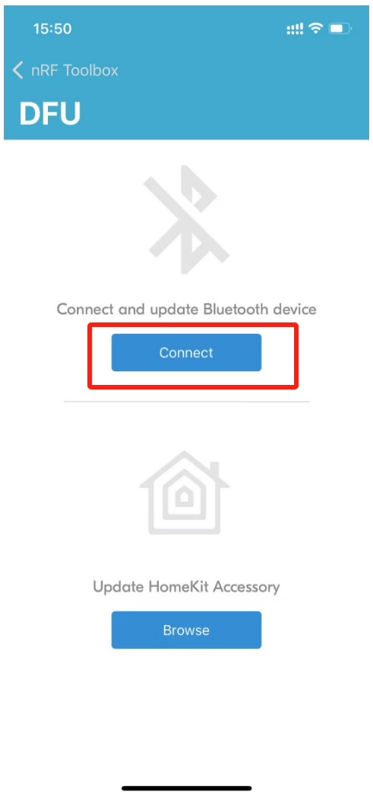
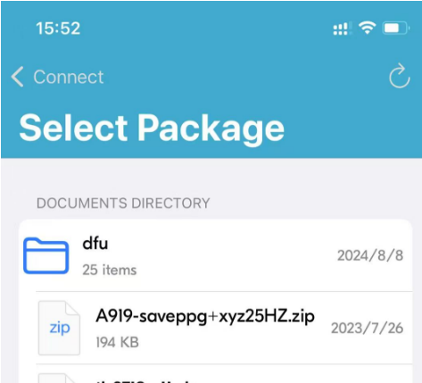
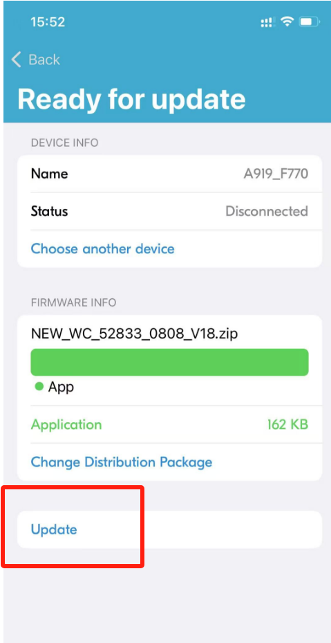

<h1 align="center">HealthRing: 健康监测戒指开源项目</h1>

<p align="center">
<a href="./README_en.md">English</a>
</p>

<p align="center">
  <a href="https://github.com/health-85/health_Ring/network/members">
    
  </a>
  <a href="https://github.com/health-85/health_Ring/blob/main/LICENSE">
    
  </a>
  <a href="https://github.com/health-85/health_Ring/stargazers">
    
  </a>
</p>


## 项目背景

随着健康意识的提高，越来越多的人开始关注日常健康监测。传统的健康监测设备往往体积较大、不便携带，而智能戒指作为一种小巧、便捷的可穿戴设备，能够满足用户随时随地监测健康的需求。HealthRing 旨在通过开源的方式，为开发者和爱好者提供一个完整的健康监测戒指解决方案，包括硬件、软件和通信协议。

## 项目简介

HealthRing 是由实翼智能科技（深圳）公司开发的一款开源健康监测戒指项目，支持心率、血压、血氧等健康指标的实时监测。该项目包含完整的 Android 应用源码，支持与硬件设备的无缝连接，帮助用户随时随地掌握自己的健康状况。

**注意**：satwatch_v2.0与rvigor是开源的两套安卓app源码，其中satwatch_v2.0用于开发调试，rvigor为基于硬件开发的一款应用app。

## 硬件购买链接

- **健康监测戒指**  
  [购买链接](https://m.tb.cn/h.hqLkoYc?tk=d9Rc473zHKVMF168)  
  *支持心率、步数、血氧、睡眠监测，适配多种尺寸，续航长达 7 天。*


## 快速体验

### 硬件准备

 **健康监测戒指**：购买链接（闲鱼店铺） [点击这里](https://m.tb.cn/h.hqLkoYc?tk=d9Rc473zHKVMF168)

### 软件安装

1. **下载 APK**  
   从 [Releases](https://github.com/health-85/health_Ring/blob/master/rvigor/app/release) 页面下载最新版本的 APK 文件。

2. **安装 APK**  
   将下载的 APK 文件传输到你的 Android 设备上，通过文件管理器安装。

3. **连接设备**  
   打开应用，进入主界面，点击“连接设备”，选择你的健康监测戒指。

4. **开始监测**  
   在主界面查看实时心率、血压、血氧数据。
   
<table>
  <tr>
    <td></td>
    <td></td>
    <td></td>
  </tr>
  <tr>
    <td>状态</td>
    <td>睡眠监测</td>
    <td>我的设置</td>
  </tr>
</table>

## 详细接入指南

### 环境准备

1. **开发工具**  
   - **Android Studio**：推荐使用最新版本的 Android Studio。
   - **Java Development Kit (JDK)**：确保已安装 JDK 1.8 或更高版本。

2. **依赖库**  
   - **Gradle**：确保已安装 Gradle，并在 Android Studio 中配置好。
   - **Android SDK**：确保已安装 Android SDK，并在 Android Studio 中配置好。

### 编译安装

1. **克隆项目**  
   ```bash
   git clone https://github.com/health-85/health_Ring.git
   cd health-85

2. **打开项目**
使用 Android Studio 打开项目。

4. **安装依赖**
在 Android Studio 中，点击 File > Project Structure，确保 build.gradle 文件中的依赖已正确配置。

5. **编译项目**
点击 Build > Rebuild Project，确保项目编译成功。

6. **运行应用**
连接 Android 设备，点击 Android Studio 的运行按钮即可。

### 功能清单
| 功能名称       | 功能描述                                                                 |
|----------------|--------------------------------------------------------------------------|
| 实时心率监测   | 实时监测用户的心率，数据秒级更新，支持图表展示。                         |
| 实时血氧监测   | 实时监测用户的血氧饱和度，数据秒级更新，支持图表展示。               |
| 心理健康分析   | 心理健康评估，包含压力、疲劳、情绪分析                   |
| 睡眠监测       | 睡眠时长、长睡眠、浅睡眠、深睡眠、REM、清醒。                               |
| 运动记录       | 步数、卡路里消耗。                 |
| 表现评价       | 对健康数据进行评分以及智能建议。                                             |
| 历史数据记录   | 支持查看过去 30 天的健康数据。
| 开源友好       | 完全开源，支持自定义功能扩展。                                           |

### 固件烧录
1. **手机下载nRF Toolbox APP
   
   

2. 打开APP，选择DFU

   

3. 搜索设备，连接名为BIO-RING-XXXX的设备

   

4. 选中固件包--[smartring-sy.zip](smartring-sy.zip)

   

5. 点击updata，等待升级完成，完成后设备会自动重启，重新连接蓝牙即可适用。

   

  
### 协议文档
请参阅 [通信协议文档](docs/戒指通信协议V2.1.docx)

### 贡献指南
欢迎贡献代码！如果你有任何改进或新功能的想法，请按照以下步骤操作：

1. **Fork 项目**
点击右上角的 Fork 按钮，将项目复制到你的 GitHub 账号。

2. **创建分支**
   ```bash
   git checkout -b feature/new-feature

3. **提交代码**
提交你的更改并推送到远程仓库。

4. **发起 Pull Request**
在 GitHub 上发起 Pull Request，等待审核。

### 许可证
本项目遵循 MIT LICENSE。

### 联系我们
有任何问题建议或者需要定制开发，请随时联系我们的开发团队：

-**Email**：kevin@realwing.com

### 技术交流
欢迎添加技术交流群
QQ:551692973

感谢你的支持！
