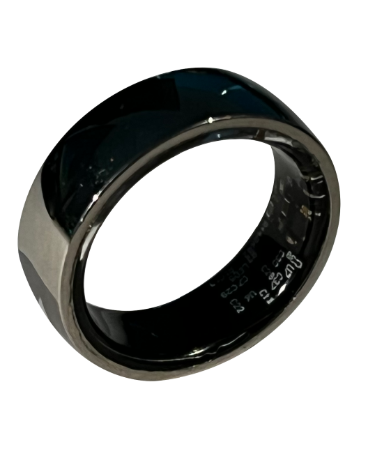
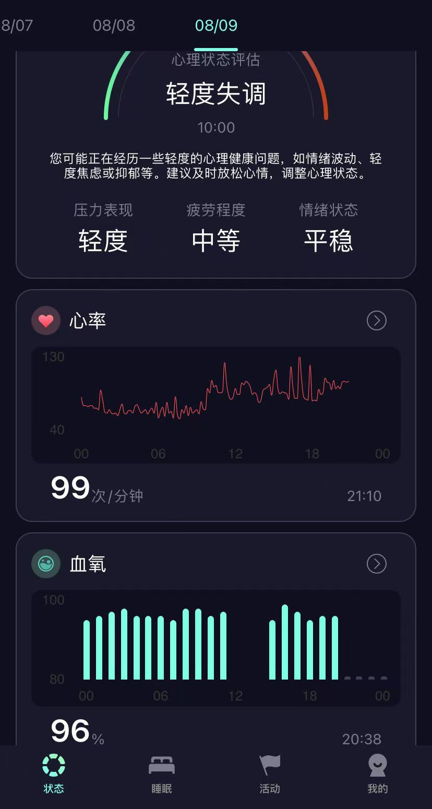
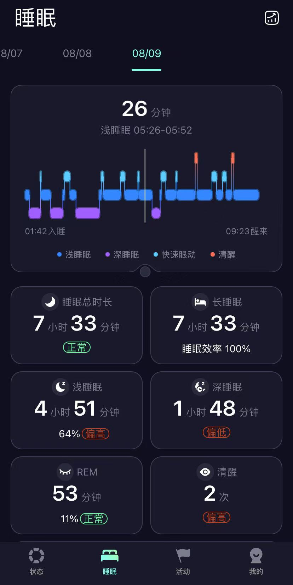
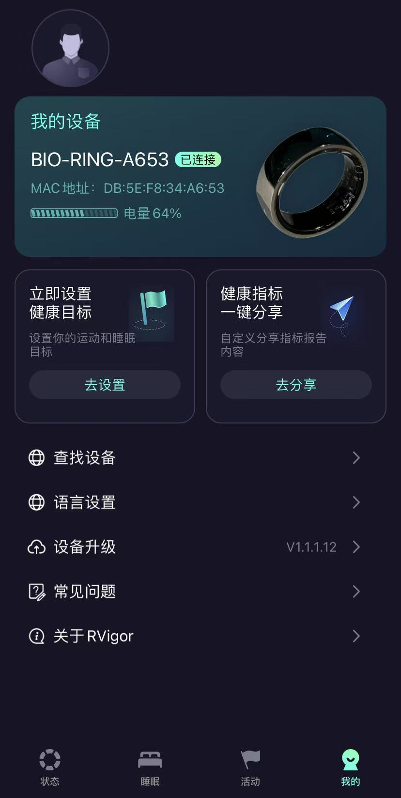
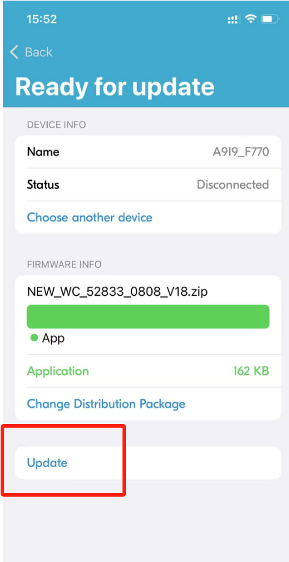

<h1 align="center">HealthRing: Health monitoring ring open source project</h1>

<p align="center">
<a href="./README.md">中文</a>
</p>

<p align="center">
  <a href="https://github.com/health-85/health_Ring/network/members">
    
  </a>
  <a href="https://github.com/health-85/health_Ring/blob/main/LICENSE">
    
  </a>
  <a href="https://github.com/health-85/health_Ring/stargazers">
    
  </a>
</p>


## Project Background

As health awareness increases, more and more people are beginning to pay attention to daily health monitoring. Traditional health monitoring devices are often bulky and inconvenient to carry, while smart rings, as compact and convenient wearable devices, can meet users' needs for health monitoring anytime, anywhere. HealthRing aims to provide developers and enthusiasts with a complete health monitoring ring solution through open-source means, including hardware, software, and communication protocols.

## Project Overview

HealthRing is an open-source health monitoring ring project developed by Shiying Intelligent Technology (Shenzhen) Co., Ltd. It supports real-time monitoring of health indicators such as heart rate, blood pressure, and blood oxygen levels. The project includes complete Android application source code and supports seamless connection with hardware devices, helping users keep track of their health status anytime, anywhere.

**Note**：satwatch_v2.0 and rvigor are two sets of open-source Android app source codes. satwatch_v2.0 is used for development and debugging, while rvigor is an application app developed based on hardware.

## Hardware purchase link

- **Health monitoring ring**  
  [Purchase link](https://m.tb.cn/h.hqLkoYc?tk=d9Rc473zHKVMF168)  
  *Supports heart rate, step count, blood oxygen, and sleep monitoring, fits multiple sizes, and lasts up to 7 days on a single charge.*


## Quick Experience

### Hardware preparation

 **Health monitoring ring**：Purchase link [Click here](https://m.tb.cn/h.hqLkoYc?tk=d9Rc473zHKVMF168)

### Software installation

1. **Download APK**  
   Download the latest version of the APK file from the [Releases](https://github.com/health-85/health_Ring/blob/master/rvigor/app/release) page. 

2. **Install APK**  
   Transfer the downloaded APK file to your Android device and install it using a file manager.。

3. **Connecting devices**  
   Open the app, go to the main interface, tap “Connect Device,” and select your health monitoring ring.

4. **Start monitoring**  
   View real-time heart rate, blood pressure, and blood oxygen data on the main interface.
   
<table>
  <tr>
    <td></td>
    <td></td>
    <td></td>
  </tr>
  <tr>
    <td>status</td>
    <td>sleep monitoring</td>
    <td>My settings</td>
  </tr>
</table>

## Detailed Access Guide

### Preparing the environment

1. **development tools**  
   - **Android Studio**：We recommend using the latest version of Android Studio.
   - **Java Development Kit (JDK)**：Ensure that JDK 1.8 or higher is installed.。

2. **dependent library**  
   - **Gradle**：Ensure that Gradle is installed and configured in Android Studio.
   - **Android SDK**：Ensure that the Android SDK is installed and configured in Android Studio.。

### Compile and install

1. **cloning project**  
   ```bash
   git clone https://github.com/health-85/health_Ring.git
   cd health-85

2. **Open project**
Open the project using Android Studio.

4. **Install dependencies**
In Android Studio, click File > Project Structure to ensure that the dependencies in the build.gradle file are configured correctly.

5. **Compile project**
Click Build > Rebuild Project to ensure that the project compiles successfully.

7. **Run application**
Connect your Android device and click the Run button in Android Studio.

### List of features
| Function name       | Function description                                                                 |
|----------------|--------------------------------------------------------------------------|
| Real-time heart rate monitoring   | Real-time monitoring of users' heart rates, with data updated every second and support for chart display.                         |
| Real-time blood oxygen monitoring   | Real-time monitoring of users' blood oxygen saturation, with data updated every second and support for chart display.               |
| Mental Health Analysis   | Mental health assessment, including stress, fatigue, and emotional analysis                   |
| sleep monitoring       | Sleep duration, long sleep, light sleep, deep sleep, REM, wakefulness.                               |
| exercise log       | Number of steps, calories burned.                 |
| Performance evaluation       | Score health data and provide intelligent recommendations.                                             |
| Historical data records   | Supports viewing health data from the past 30 days.
| Open source friendly       | Completely open source, supports custom feature extensions.                                           |
  
### Firmware burning
1. **mobile download nRF Toolbox APP**
   
   

2. **Open the app and select DFU.**

   

3. **Search for devices and connect to the device named BIO-RING-XXXX.**

   

4. **Select firmware package--[smartring-sy.zip](smartring-sy.zip)**

   

5. **Click “Update” and wait for the upgrade to complete. Once complete, the device will automatically restart. Simply reconnect to Bluetooth to use it.**

   


### Agreement document
Please refer to [Communication Protocol Documentation](docs/戒指通信协议V2.1.docx)

### Contribution Guidelines
We welcome code contributions! If you have any ideas for improvements or new features, please follow these steps:

1. **Fork project**
Click the Fork button in the upper right corner to copy the project to your GitHub account.

2. **Create branch**
   ```bash
   git checkout -b feature/new-feature

3. **Submit code**
Submit your changes and push them to the remote repository.

4. **initiate Pull Request**
Initiate a Pull Request on GitHub and wait for review.

### license
This project is licensed under the MIT License.

### Contact us
If you have any questions, suggestions, or need custom development, please feel free to contact our development team:

-**Email**：kevin@realwing.com

### technical exchange
Welcome to join our technical exchange group.

QQ:551692973

Thanks for your support!
